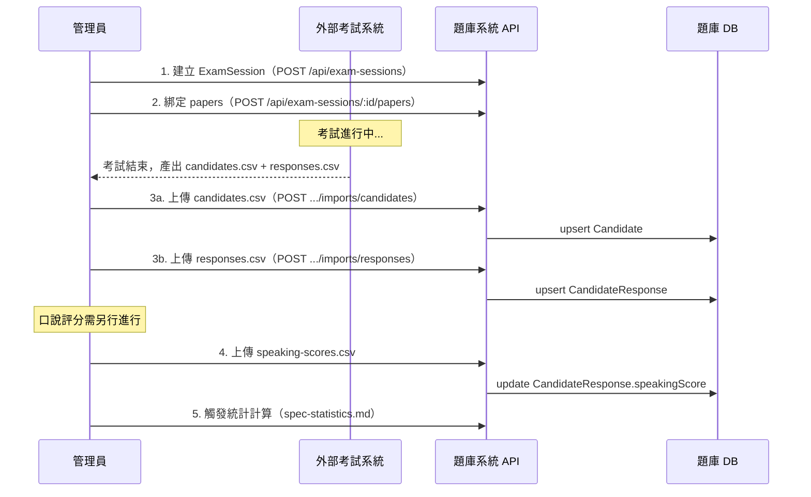

# 考期與應答匯入規格 (Exam Session & Import Spec)

<!-- anchor: overview -->

## 0. 文件目的

本文件定義「考期 (Exam Session)」與「外部考試系統應答匯入」模組。題庫系統本身**不負責應考介面**，而是接收外部考試系統匯入的：

- 考生 demographic（年齡層、學校類型等）
- 選擇題答題結果（含正確與否、得分）
- 聽寫答案
- 口說題評分（可後補匯入）

並把這些資料歸類到對應的「考期/場次」，供 [statistics 模組](./spec-statistics.md) 計算 CTT 三大指標（P 難度 / D 鑑別度 / distractor 誘答力）。

**閱讀本文件前不需其他 context**。新增的 4 個 Prisma model 完整定義在 §2，所有 API 在 §4–§6。

**前置依賴**：

- [spec-question-bank.md](./spec-question-bank.md)：題目資料模型
- [spec-exam-assembly.md](./spec-exam-assembly.md)：`ExamPaper` 已存在
- [api-response.md](./api-response.md)：統一回應格式

**範圍邊界**：

- 在範圍：考期 CRUD、考生匯入、應答匯入、口說評分匯入、API key 機制、抽題策略開關
- 不在範圍：應考介面、即時評分、考生本人查詢成績（外部考試系統處理）、Statistics 計算（見 [spec-statistics.md](./spec-statistics.md)）

---

<!-- anchor: 1-concepts -->

## 1. 領域概念

### 1.1 ExamSession（考期/場次）

代表一次具體的考試活動，例如「2026 春季全民台語檢定」。一個 ExamSession：

- 屬於一個 `ExamCategory`（GTPT 或 TSH）
- 綁定 1–N 份 `ExamPaper`（一個場次可能有 A 卷/B 卷防作弊）
- 收集多個 Candidate 的 demographic 與作答資料

> 現階段「考過的題目不再考」是業務規則，因此每份 paper 通常只屬於一個 session。但 schema 設計**允許**未來「同一份 paper 跨 session 重用」，方便將來「隨到隨考」放寬限制。

### 1.2 Candidate（考生）

匯入自外部考試系統的考生。題庫系統**不存個資**（姓名、身分證號），只存：

- `externalCandidateId`：外部系統的考生編號（可逆向追溯，但題庫系統不解碼）
- demographic：年齡層、學校類型 + 其他 JSONB 彈性欄位

### 1.3 CandidateResponse（應答紀錄）

考生對某題的單筆作答。同一筆紀錄涵蓋三種題型：

- 選擇題：填 `selectedOptionId`、`isCorrect`、`pointsEarned`
- 聽寫：填 `writtenAnswer`、`isCorrect`、`pointsEarned`
- 口說：先寫入「應答存在」紀錄（其他欄位空），等口說評分匯入時再 update `speakingScore`

### 1.4 匯入流程概念



未來考試系統直接接 API 時：步驟 3a/3b/4 改用 API key 推送，不需人工上傳。

---

<!-- anchor: 2-schema -->

## 2. Prisma Schema

### 2.1 新增 Enum

```prisma
enum ExamSessionStatus {
  DRAFT       // 場次建立但尚未匯入資料
  IMPORTED    // 已匯入考生與應答資料
  ARCHIVED    // 封存（不再列入新統計，但既有統計保留）

  @@map("exam_session_status")
}
```

### 2.2 ExamSession

```prisma
model ExamSession {
  id            String              @id @default(uuid())
  name          String              // e.g. "2026 春季全民台語檢定"
  examCategory  ExamCategory        // GTPT 或 TSH
  examDate      DateTime            // 實際考試日期
  status        ExamSessionStatus   @default(DRAFT)
  description   String?             // 備註

  createdById   String
  createdBy     User                @relation("ExamSessionCreator", fields: [createdById], references: [id])

  createdAt     DateTime            @default(now())
  updatedAt     DateTime            @updatedAt

  papers        ExamSessionPaper[]
  candidates    Candidate[]
  responses     CandidateResponse[]
  stats         QuestionStatistics[]

  @@index([examCategory, examDate])
  @@map("exam_sessions")
}
```

### 2.3 ExamSessionPaper（考期↔考卷的中介表）

```prisma
model ExamSessionPaper {
  examSessionId   String
  examPaperId     String
  paperVariant    String?       // 'A' / 'B' / 'C' (預留多卷版)
  attachedAt      DateTime      @default(now())

  examSession     ExamSession   @relation(fields: [examSessionId], references: [id], onDelete: Cascade)
  examPaper       ExamPaper     @relation("ExamSessionPapers", fields: [examPaperId], references: [id], onDelete: Restrict)

  @@id([examSessionId, examPaperId])
  @@index([examPaperId])
  @@map("exam_session_papers")
}
```

> 注意：`ExamPaper` 在 [spec-exam-assembly.md](./spec-exam-assembly.md) 中已存在；此處僅補關聯欄位 `examSessionPapers ExamSessionPaper[]` 在 `ExamPaper` model 中。

### 2.4 Candidate

```prisma
model Candidate {
  id                  String    @id @default(uuid())
  examSessionId       String
  externalCandidateId String    // 外部考試系統的考生編號

  // ===== 固定欄位（hybrid 策略：常用分群欄位） =====
  ageGroup            String?   // 例如 "ELEMENTARY"、"JUNIOR_HIGH"、"SENIOR_HIGH"、"ADULT"
  schoolType          String?   // 例如 "PUBLIC_PRIMARY"、"PRIVATE_HIGH"、"UNIVERSITY"

  // ===== 彈性欄位（其他 demographic 全進這裡） =====
  // 範例: { "city": "Taipei", "gender": "F", "nativeLanguage": "Hokkien", "yearsLearning": 5 }
  demographic         Json      @default("{}")

  // ===== 成績總覽（匯入時計算或外部給定） =====
  totalScore          Float?    // 總得分
  paperVariant        String?   // 該考生領的是哪份卷（A/B）

  importedAt          DateTime  @default(now())

  examSession         ExamSession         @relation(fields: [examSessionId], references: [id], onDelete: Cascade)
  responses           CandidateResponse[]

  @@unique([examSessionId, externalCandidateId])
  @@index([examSessionId, ageGroup])
  @@index([examSessionId, schoolType])
  @@map("candidates")
}
```

### 2.5 CandidateResponse

```prisma
model CandidateResponse {
  id                  String    @id @default(uuid())
  examSessionId       String
  candidateId         String
  questionId          String

  // ===== 應答內容（依題型擇一填寫） =====
  selectedOptionId    String?   // 選擇題：選了 content.options 中哪個 id
  writtenAnswer       String?   // 聽寫題：考生寫的答案
  speakingScore       Float?    // 口說題：人工評分（可後補）

  // ===== 評分結果（外部考試系統算好後匯入） =====
  isCorrect           Boolean?  // 選擇/聽寫題：是否答對；口說題為 null
  pointsEarned        Float?    // 該題得分

  importedAt          DateTime  @default(now())
  speakingScoredAt    DateTime? // 口說評分匯入時間

  candidate           Candidate    @relation(fields: [candidateId], references: [id], onDelete: Cascade)
  question            Question     @relation("CandidateResponses", fields: [questionId], references: [id], onDelete: Restrict)
  examSession         ExamSession  @relation(fields: [examSessionId], references: [id], onDelete: Cascade)

  @@unique([candidateId, questionId])
  @@index([questionId, examSessionId])
  @@index([examSessionId])
  @@map("candidate_responses")
}
```

> `Question` model 需補關聯 `candidateResponses CandidateResponse[] @relation("CandidateResponses")`。

### 2.6 ApiClient（API key 管理）

外部考試系統需用 API key 推送資料。建立簡單表存 hashed key：

```prisma
model ApiClient {
  id            String    @id @default(uuid())
  name          String                          // e.g. "TaigiCore Exam System"
  keyHash       String    @unique               // sha256 of plain key
  scopes        String[]                        // e.g. ["import:responses", "import:candidates"]
  isActive      Boolean   @default(true)
  lastUsedAt    DateTime?

  createdById   String
  createdBy     User      @relation("ApiClientCreator", fields: [createdById], references: [id])

  createdAt     DateTime  @default(now())
  revokedAt     DateTime?

  @@map("api_clients")
}
```

> `User` model 需補：
> ```prisma
> examSessionsCreated  ExamSession[]  @relation("ExamSessionCreator")
> apiClientsCreated    ApiClient[]    @relation("ApiClientCreator")
> ```

### 2.7 既有 schema 修改

於 [packages/backend/prisma/schema.prisma](../packages/backend/prisma/schema.prisma)：

- `ExamPaper.blueprintId` → `String?` + `onDelete: SetNull`（修 spec 不一致，見 [spec-bugfixes.md](./spec-bugfixes.md) 雖未列為 P0 但本 phase 順便修）
- `ExamPaper` 補關聯：`examSessionPapers ExamSessionPaper[] @relation("ExamSessionPapers")`
- `Question` 補關聯：`candidateResponses CandidateResponse[] @relation("CandidateResponses")`
- `Question` 補索引：`@@index([groupId])`
- `QuestionMedia.purpose` → 改 enum（見 [spec-bugfixes.md](./spec-bugfixes.md) 同樣是 phase 6 才動，這裡不動）

### 2.8 新權限

於 seed.ts 與 [packages/shared/src/permissions.ts](../packages/shared/src/permissions.ts) 新增：

```typescript
// shared
EXAM_SESSION_CREATE: 'exam-session:create',
EXAM_SESSION_READ: 'exam-session:read',
EXAM_SESSION_UPDATE: 'exam-session:update',
EXAM_SESSION_DELETE: 'exam-session:delete',
EXAM_SESSION_IMPORT: 'exam-session:import',
API_CLIENT_MANAGE: 'api-client:manage',
```

對應 seed Role-Permission Mapping：

- ADMIN: 全部
- ASSEMBLER: `exam-session:create`, `exam-session:read`, `exam-session:update`, `exam-session:import`
- AUTHOR / REVIEWER: 無

---

<!-- anchor: 3-state-machine -->

## 3. ExamSession 狀態機

```
DRAFT ──(綁定 papers + 匯入完成)──> IMPORTED ──(管理員封存)──> ARCHIVED
                                       ↑              │
                                       │              │
                                       └──(可選)──────┘
                                       重新匯入修正
```

| 目前狀態 | 目標狀態 | 動作 | 條件 |
|---|---|---|---|
| `DRAFT` | `IMPORTED` | 完成匯入 | 至少 1 份 paper 已綁定，且 candidates 表有資料 |
| `IMPORTED` | `IMPORTED` | 重新匯入修正 | 容許重新上傳覆蓋（冪等） |
| `IMPORTED` | `ARCHIVED` | 封存 | 由管理員手動觸發 |
| `ARCHIVED` | — | — | 不可逆 |

**狀態鎖定規則**：

- `DRAFT`：可任意修改（綁卷、解綁卷、改名、刪除整個 session）
- `IMPORTED`：可重新匯入；但 papers 解綁、改 examCategory 一律拒絕
- `ARCHIVED`：完全唯讀。但既有的 QuestionStatistics 仍保留可查詢

---

<!-- anchor: 4-api-session -->

## 4. API：ExamSession CRUD

### 4.1 建立場次 `POST /api/exam-sessions`

- **權限**：`exam-session:create`
- **Request Body**：

  ```json
  {
    "name": "2026 春季全民台語檢定",
    "examCategory": "GTPT",
    "examDate": "2026-04-15",
    "description": "北中南各 1 間學校"
  }
  ```

- **驗證**：
  - `name` 必填 minLength 1
  - `examCategory` 必須為合法 Enum 值
  - `examDate` 為合法 ISO 日期
- **邏輯**：建立 `ExamSession`，`status = DRAFT`，`createdById` 為當前使用者
- **Response**：建立後的 session 完整資訊（不含 candidates / responses 細節）

### 4.2 列表 `GET /api/exam-sessions`

- **權限**：`exam-session:read`
- **Query**：
  | 參數 | 類型 | 預設 | 說明 |
  |---|---|---|---|
  | `page` | number | 1 | |
  | `pageSize` | number | 20 | 上限 100 |
  | `examCategory` | string | — | 篩選 |
  | `status` | string | — | 篩選（多選逗號） |

- **Response data**：每筆含 `id`, `name`, `examCategory`, `examDate`, `status`, `createdBy { id, name }`, `_count { papers, candidates, responses }`, `createdAt`

### 4.3 詳情 `GET /api/exam-sessions/:id`

- **權限**：`exam-session:read`
- **Response data**：
  - 完整 session 資訊
  - `papers[]`：含 `paperVariant`, `paper { id, name, status }`, `attachedAt`
  - `_count`：`candidates`, `responses`
  - 「匯入摘要」：`{ totalCandidates, totalResponses, responsesWithSpeakingScore, lastImportedAt }`

### 4.4 更新 `PATCH /api/exam-sessions/:id`

- **權限**：`exam-session:update`
- **Request Body**（皆選填）：

  ```json
  {
    "name": "...",
    "examDate": "2026-04-16",
    "description": "..."
  }
  ```

- **狀態限制**：
  - `DRAFT`：name / examDate / description / examCategory 都可改
  - `IMPORTED`：只能改 name / description（`examCategory`、`examDate` 鎖定）
  - `ARCHIVED`：拒絕 → `ERR_EXAM_SESSION_LOCKED`

### 4.5 變更狀態 `PATCH /api/exam-sessions/:id/status`

- **權限**：`exam-session:update`
- **Request Body**：

  ```json
  { "action": "MARK_IMPORTED" | "ARCHIVE" }
  ```

- **驗證**：
  - `MARK_IMPORTED`：須有至少 1 份 paper 綁定，且 candidate 數 > 0，否則回 `ERR_VALIDATION`
  - `ARCHIVE`：僅允許 `IMPORTED → ARCHIVED`
- **Response**：更新後的 session

### 4.6 刪除 `DELETE /api/exam-sessions/:id`

- **權限**：`exam-session:delete`
- **狀態限制**：僅 `DRAFT` 可刪。`IMPORTED` / `ARCHIVED` 拒絕。
- **邏輯**：cascade 刪除 ExamSessionPaper / Candidate / CandidateResponse。已計算的 QuestionStatistics 也跟著刪。

### 4.7 綁定 paper `POST /api/exam-sessions/:id/papers`

- **權限**：`exam-session:update`
- **Request Body**：

  ```json
  {
    "examPaperId": "uuid",
    "paperVariant": "A"
  }
  ```

- **驗證**：
  - paper 必須存在且 `status = PUBLISHED`
  - paper 的 `blueprint.examCategory` 必須等於 session 的 `examCategory`
  - `paperVariant` 在同一 session 內須唯一（多份 A 卷不允許）
  - session `status` 須為 `DRAFT`

- **Response**：更新後的 session（含 papers 列表）

### 4.8 解綁 paper `DELETE /api/exam-sessions/:id/papers/:paperId`

- **權限**：`exam-session:update`
- **狀態限制**：僅 `DRAFT` 可解綁
- **Response**：更新後的 session

---

<!-- anchor: 5-import-formats -->

## 5. 匯入資料格式

### 5.1 設計原則

- **冪等**：同一筆 `(examSessionId, externalCandidateId)` 重新匯入會 upsert（覆蓋舊資料）
- **批次**：CSV/JSON 一次匯入整個場次的全部資料（建議分檔上傳：先 candidates 再 responses）
- **錯誤回報**：匯入過程逐筆驗證，失敗的列回傳於 `details` 陣列，不中斷整批
- **匯入順序**：
  1. **必須**先匯 candidates → 再匯 responses（responses 需要 candidate FK）
  2. 口說分數最後匯（更新已存在的 responses）

### 5.2 Candidates 匯入格式

#### 5.2.1 CSV 格式

第一列為 header，欄位名固定如下：

```csv
externalCandidateId,paperVariant,ageGroup,schoolType,totalScore,demographic_json
EXAM2026S001,A,JUNIOR_HIGH,PUBLIC_HIGH,82.5,"{""city"":""Taipei"",""gender"":""F""}"
EXAM2026S002,A,JUNIOR_HIGH,PUBLIC_HIGH,75.0,"{""city"":""Kaohsiung"",""gender"":""M""}"
EXAM2026S003,B,SENIOR_HIGH,PRIVATE_HIGH,91.0,"{}"
```

**欄位說明**：

| 欄位 | 必填 | 說明 |
|---|---|---|
| `externalCandidateId` | Y | 外部系統考生編號 |
| `paperVariant` | N | 該考生領的卷（A/B），須對應已綁定到 session 的 paper |
| `ageGroup` | N | 自由字串，建議列舉值 |
| `schoolType` | N | 自由字串 |
| `totalScore` | N | 數值 |
| `demographic_json` | N | JSON 字串（CSV 內需 escape 雙引號）；若為空填 `{}` |

#### 5.2.2 JSON 格式

```json
{
  "candidates": [
    {
      "externalCandidateId": "EXAM2026S001",
      "paperVariant": "A",
      "ageGroup": "JUNIOR_HIGH",
      "schoolType": "PUBLIC_HIGH",
      "totalScore": 82.5,
      "demographic": {
        "city": "Taipei",
        "gender": "F"
      }
    }
  ]
}
```

### 5.3 Responses 匯入格式

#### 5.3.1 CSV 格式

```csv
externalCandidateId,questionId,selectedOptionId,writtenAnswer,isCorrect,pointsEarned
EXAM2026S001,uuid-q-001,a1b2c3d4,,true,2.0
EXAM2026S001,uuid-q-002,c3d4e5f6,,false,0.0
EXAM2026S001,uuid-q-003,,bí-phang,true,3.0
EXAM2026S001,uuid-q-004,,,,
```

**欄位說明**：

| 欄位 | 必填 | 說明 |
|---|---|---|
| `externalCandidateId` | Y | 須已存在於 candidates 表，否則該列被 reject |
| `questionId` | Y | 題庫題目 UUID；題目必須屬於該 session 綁定的某份 paper |
| `selectedOptionId` | N | 選擇題用，對應 `content.options[].id` |
| `writtenAnswer` | N | 聽寫題用 |
| `isCorrect` | N | 選擇/聽寫：boolean；口說題留空 |
| `pointsEarned` | N | 該題實際得分；口說題若尚未評分留空 |

> 口說題在此階段先匯入「應答存在」的紀錄（其他欄位可留空），等口說評分匯入時補 `speakingScore` 與 `pointsEarned`。

#### 5.3.2 JSON 格式

```json
{
  "responses": [
    {
      "externalCandidateId": "EXAM2026S001",
      "questionId": "uuid-q-001",
      "selectedOptionId": "a1b2c3d4",
      "isCorrect": true,
      "pointsEarned": 2.0
    },
    {
      "externalCandidateId": "EXAM2026S001",
      "questionId": "uuid-q-003",
      "writtenAnswer": "bí-phang",
      "isCorrect": true,
      "pointsEarned": 3.0
    }
  ]
}
```

### 5.4 Speaking Scores 匯入格式

```csv
externalCandidateId,questionId,speakingScore,pointsEarned
EXAM2026S001,uuid-q-005,4.5,9.0
EXAM2026S002,uuid-q-005,3.0,6.0
```

**欄位說明**：

| 欄位 | 必填 | 說明 |
|---|---|---|
| `externalCandidateId` | Y | 須已存在 |
| `questionId` | Y | 題目須為 SPEAKING 類型且已有對應 response 紀錄 |
| `speakingScore` | Y | 評分數值（0–滿分） |
| `pointsEarned` | Y | 折算後得分 |

匯入後 `speakingScoredAt = now()`。可重新匯入覆蓋（修正錯誤）。

---

<!-- anchor: 6-api-imports -->

## 6. API：匯入端點

兩種匯入方式並存：

- **Web UI 上傳**：管理員在後台手動上傳檔案，走 Session Cookie + CSRF
- **API key 推送**：外部考試系統用 X-Api-Key 推送，**走 CSRF 例外清單**（見 [spec-bugfixes.md §2.3](./spec-bugfixes.md#2-bug-1csrf-%E5%85%A8%E5%9F%9F%E6%9C%AA%E5%A5%97%E7%94%A8) 的 `CSRF_EXEMPT_PREFIXES`）

### 6.1 Web UI：上傳 candidates `POST /api/exam-sessions/:id/imports/candidates`

- **權限**：`exam-session:import`（Session Cookie）
- **Request**：`multipart/form-data`
  - `file`: 必填，CSV 或 JSON
  - `format`: 必填 `csv` | `json`
  - `dryRun`: optional boolean，預設 `false`。`true` 時只驗證不寫入
- **回應**：

  ```json
  {
    "success": true,
    "data": {
      "totalRows": 3245,
      "inserted": 3200,
      "updated": 30,
      "skipped": 15,
      "errors": [
        { "row": 12, "field": "ageGroup", "message": "..." }
      ]
    },
    "message": "匯入完成"
  }
  ```

- **冪等鍵**：`(examSessionId, externalCandidateId)`

### 6.2 Web UI：上傳 responses `POST /api/exam-sessions/:id/imports/responses`

- 介面同 §6.1
- 額外驗證：每筆 response 的 `questionId` 必須屬於該 session 綁定的 paper（`questionId IN ExamPaperQuestion.questionId WHERE examPaperId IN session.papers`）；不符的列 skip 並記錯
- **冪等鍵**：`(candidateId, questionId)`

### 6.3 Web UI：上傳 speaking scores `POST /api/exam-sessions/:id/imports/speaking-scores`

- 介面同 §6.1
- 額外驗證：response 須已存在；題目 `type === 'SPEAKING'`
- 動作為 update（不會新增 response 紀錄）

### 6.4 API key 推送：候選 endpoint

下列端點**走 CSRF 例外**（已在 [spec-bugfixes.md](./spec-bugfixes.md) 的 `CSRF_EXEMPT_PREFIXES` 包含 `/api/exam-sessions/imports/api/`）：

- `POST /api/exam-sessions/imports/api/candidates`
- `POST /api/exam-sessions/imports/api/responses`
- `POST /api/exam-sessions/imports/api/speaking-scores`

**Request**：

- Header：`X-Api-Key: <plain key>`
- Body：JSON（`§5` 定義的 JSON 格式），`examSessionId` 改放 body 內：

  ```json
  {
    "examSessionId": "uuid",
    "candidates": [...]
  }
  ```

**驗證**：

- API key sha256 後查 `ApiClient.keyHash`
- `ApiClient.isActive = true` 且 `revokedAt` 為 null
- `ApiClient.scopes` 包含對應 scope（如 `import:candidates`）
- 通過後更新 `ApiClient.lastUsedAt`
- 驗證失敗回 `401 ERR_API_KEY_INVALID`

### 6.5 匯入結果查詢 `GET /api/exam-sessions/:id/imports`

- **權限**：`exam-session:read`
- **回應**：每次匯入操作的歷程清單（含 `type` / `actor` / `inserted` / `updated` / `errors` / `createdAt`）

  > 為此需新增 `ImportLog` 表（簡單）：
  > ```prisma
  > model ImportLog {
  >   id              String    @id @default(uuid())
  >   examSessionId   String
  >   importType      String    // 'candidates' | 'responses' | 'speaking_scores'
  >   sourceFormat    String    // 'csv' | 'json'
  >   actorType       String    // 'user' | 'api_client'
  >   actorId         String?
  >   totalRows       Int
  >   inserted        Int
  >   updated         Int
  >   skipped         Int
  >   errors          Json      @default("[]")
  >   createdAt       DateTime  @default(now())
  >   examSession     ExamSession @relation(fields: [examSessionId], references: [id], onDelete: Cascade)
  >   @@index([examSessionId])
  >   @@map("import_logs")
  > }
  > ```

---

<!-- anchor: 7-api-clients -->

## 7. API：API Client（API key）管理

### 7.1 列表 `GET /api/admin/api-clients`

- **權限**：`api-client:manage`
- **Response data**：每筆含 `id`, `name`, `scopes`, `isActive`, `lastUsedAt`, `createdAt`, `revokedAt`（**不含** keyHash）

### 7.2 建立 `POST /api/admin/api-clients`

- **權限**：`api-client:manage`
- **Request Body**：

  ```json
  {
    "name": "Production Exam System",
    "scopes": ["import:candidates", "import:responses", "import:speaking_scores"]
  }
  ```

- **邏輯**：
  - 生成 64 byte 隨機 plain key
  - 計算 sha256 存 `keyHash`
  - **plain key 僅在此次回應顯示一次**，前端複製後就再也看不到（同 setup token）
- **Response**：

  ```json
  {
    "success": true,
    "data": {
      "id": "uuid",
      "name": "Production Exam System",
      "scopes": [...],
      "plainKey": "tg_live_<128 hex chars>",
      "createdAt": "..."
    },
    "message": "請複製並妥善保管 plainKey，此後將無法再次查看"
  }
  ```

### 7.3 撤銷 `PATCH /api/admin/api-clients/:id/revoke`

- **權限**：`api-client:manage`
- **邏輯**：設定 `isActive = false`、`revokedAt = now()`
- **Response**：撤銷後的 client

### 7.4 重新生成 key `POST /api/admin/api-clients/:id/rotate`

- **權限**：`api-client:manage`
- **邏輯**：產生新 key 覆蓋 `keyHash`，舊 key 立即失效
- **Response**：新的 plainKey（同 §7.2）

---

<!-- anchor: 8-impl -->

## 8. 實作細節

### 8.1 模組結構

```
packages/backend/src/modules/exam-sessions/
├── exam-sessions.routes.ts      # CRUD + status
├── exam-sessions.service.ts     # CRUD + 綁卷邏輯
├── exam-sessions.schema.ts      # TypeBox
├── imports.routes.ts            # 兩種匯入入口
├── imports.service.ts           # 純函式 + DB upsert
├── imports.parser.ts            # CSV/JSON 解析（無 IO）
└── index.ts

packages/backend/src/modules/api-clients/
├── api-clients.routes.ts
├── api-clients.service.ts
├── api-clients.schema.ts
└── index.ts

packages/backend/src/plugins/
└── apiKeyAuth.ts                # 新 plugin: 驗 X-Api-Key 並 decorate request.apiClient
```

### 8.2 API key auth plugin

```typescript
// plugins/apiKeyAuth.ts
import fp from 'fastify-plugin'
import { createHash } from 'node:crypto'
import type { FastifyInstance, FastifyRequest } from 'fastify'
import { AppError } from '../utils/errors.js'
import { ErrorCode } from '../types/response.js'

declare module 'fastify' {
  interface FastifyRequest {
    apiClient?: { id: string; scopes: string[]; name: string }
  }
}

async function apiKeyAuthPlugin(fastify: FastifyInstance) {
  fastify.decorateRequest('apiClient', undefined)
}

export default fp(apiKeyAuthPlugin, { name: 'api-key-auth' })

/**
 * 用作 preHandler：驗證 X-Api-Key 並檢查 scope。
 */
export function requireApiKey(scope: string) {
  return async (request: FastifyRequest) => {
    const plain = request.headers['x-api-key']
    if (!plain || typeof plain !== 'string') {
      throw new AppError(401, ErrorCode.API_KEY_INVALID, '未提供 X-Api-Key')
    }

    const keyHash = createHash('sha256').update(plain).digest('hex')
    const client = await request.server.prisma.apiClient.findUnique({
      where: { keyHash },
    })

    if (!client || !client.isActive || client.revokedAt) {
      throw new AppError(401, ErrorCode.API_KEY_INVALID, '無效的 API key')
    }

    if (!client.scopes.includes(scope)) {
      throw new AppError(403, ErrorCode.FORBIDDEN, `此 API key 缺少 scope: ${scope}`)
    }

    request.apiClient = { id: client.id, scopes: client.scopes, name: client.name }

    // 非阻塞更新 lastUsedAt（不 await）
    void request.server.prisma.apiClient.update({
      where: { id: client.id },
      data: { lastUsedAt: new Date() },
    })
  }
}
```

於 [packages/backend/src/app.ts](../packages/backend/src/app.ts) 註冊：

```typescript
import apiKeyAuthPlugin from './plugins/apiKeyAuth.js'
// after decoratorsPlugin:
await app.register(apiKeyAuthPlugin)
```

### 8.3 CSV parser 套件

新增依賴：

```bash
pnpm --filter @taigi-core/backend add csv-parse
pnpm --filter @taigi-core/backend add @fastify/multipart
```

`@fastify/multipart` 已用於媒體上傳，若已註冊則重用即可。

### 8.4 imports.service.ts 主要介面

```typescript
export interface ImportResult {
  totalRows: number
  inserted: number
  updated: number
  skipped: number
  errors: Array<{ row?: number; externalCandidateId?: string; field?: string; message: string }>
}

export async function importCandidates(
  prisma: PrismaClient,
  examSessionId: string,
  rows: CandidateImportRow[],
  context: { actorType: 'user' | 'api_client'; actorId: string },
): Promise<ImportResult>

export async function importResponses(
  prisma: PrismaClient,
  examSessionId: string,
  rows: ResponseImportRow[],
  context: { actorType: 'user' | 'api_client'; actorId: string },
): Promise<ImportResult>

export async function importSpeakingScores(
  prisma: PrismaClient,
  examSessionId: string,
  rows: SpeakingScoreImportRow[],
  context: { actorType: 'user' | 'api_client'; actorId: string },
): Promise<ImportResult>
```

實作 tip：

- 用 `prisma.$transaction` 包裝整批，但若期望「容忍錯誤逐列繼續」則改用 `Promise.allSettled` + 個別 upsert（不在 transaction 內）。建議**後者**，且每 100 筆 chunk batch 一次 `createMany` / `updateMany`。
- 結束後寫一筆 `ImportLog`。

### 8.5 抽題策略開關（已在 spec-export §4.5 描述）

不重複，見 [spec-export.md §4.5](./spec-export.md#45-%E6%8A%BD%E9%A1%8C%E7%AD%96%E7%95%A5%E9%96%8B%E9%97%9C-excludeusedquestions)。

---

<!-- anchor: 9-frontend -->

## 9. 前端整合

### 9.1 新頁面結構

```
packages/frontend/src/pages/ExamSession/
├── ExamSessionList.tsx         # 列表
├── ExamSessionForm.tsx         # 建立/編輯
├── ExamSessionDetail.tsx       # 詳情 + 綁卷管理 + 匯入面板
└── components/
    ├── BindPaperModal.tsx
    ├── ImportPanel.tsx          # 三個匯入區塊：candidates / responses / speaking-scores
    └── ImportHistoryTable.tsx
```

### 9.2 ExamSessionDetail 頁主要區塊

1. **基本資訊** Card：name / examCategory / examDate / status / description
2. **綁定考卷** Card：列出已綁卷（含 paperVariant），可解綁（DRAFT only），點「綁定考卷」打開 BindPaperModal
3. **匯入面板**（DRAFT/IMPORTED 顯示）：
   - 三個 Tab：考生 / 應答 / 口說評分
   - 各 Tab 含：
     - 上傳檔案 (Antd `<Upload>`)
     - 格式選擇 (CSV / JSON)
     - dryRun checkbox
     - 上傳按鈕
     - 結果 Alert（顯示 inserted / updated / errors）
4. **匯入歷程** Table：呼叫 `GET /api/exam-sessions/:id/imports`
5. **動作按鈕**：
   - DRAFT：標記為已匯入 (`MARK_IMPORTED`)
   - IMPORTED：封存 / 觸發統計重算（連 statistics 模組）
   - DRAFT：刪除

### 9.3 API Client 管理頁

`pages/admin/ApiClients/index.tsx`：

- Table 列出所有 client
- 「新增」開 Modal，填 name + scopes（multi-select）
- 建立成功後**強制**用 Result Modal 顯示 plainKey（含 copyable + 警告文字）
- 各列「撤銷」與「Rotate」操作

---

<!-- anchor: 10-error-codes -->

## 10. 新增錯誤碼

於 [packages/shared/src/response.ts](../packages/shared/src/response.ts) 與 [api-response.md](./api-response.md) 新增：

| Error Code | HTTP Status | 說明 |
|---|---|---|
| `ERR_EXAM_SESSION_LOCKED` | 403 | session 已 IMPORTED 或 ARCHIVED，禁止此修改 |
| `ERR_EXAM_SESSION_PAPER_MISMATCH` | 400 | 綁定的 paper 與 session examCategory 不符 |
| `ERR_PAPER_VARIANT_DUPLICATE` | 409 | 同一 session 內同 paperVariant 已綁定 |
| `ERR_IMPORT_FORMAT_INVALID` | 400 | CSV/JSON 格式錯誤（缺欄位、不可解析） |
| `ERR_IMPORT_CANDIDATE_NOT_FOUND` | 400 | 匯入 responses 時參照的 externalCandidateId 不存在 |
| `ERR_IMPORT_QUESTION_NOT_IN_PAPER` | 400 | 匯入 responses 時 questionId 不屬於 session 綁定的任何 paper |
| `ERR_API_KEY_INVALID` | 401 | API key 無效或已撤銷 |
| `ERR_API_CLIENT_NOT_FOUND` | 404 | API client 不存在 |

---

<!-- anchor: 11-do-dont -->

## 11. DO / DON'T

### DO

- 把 CSV/JSON parsing 與 DB upsert 分開——parser 是 pure function，方便測試
- 匯入時逐筆 try/catch，把錯誤累積到 `errors` 陣列，不中斷整批
- 用 `(examSessionId, externalCandidateId)` 與 `(candidateId, questionId)` 兩層 unique 確保冪等
- API key 用 `sha256` 雜湊存 DB，明文僅在建立時回傳一次
- 路由分清楚：Web UI 走 `/api/exam-sessions/:id/imports/...`（CSRF 強制）；API key 走 `/api/exam-sessions/imports/api/...`（CSRF 例外）

### DON'T

- 不要把整批 import 包在 `prisma.$transaction` 內——3000+ 筆會撐爆 transaction，且第 1 筆錯就全 rollback 不利於排錯
- 不要把外部 candidate 真實姓名/身分證寫入 DB——本系統只認 `externalCandidateId`
- 不要在匯入時自動算 isCorrect——這是外部考試系統的職責，題庫系統只接收結果
- 不要用 `examSessionId` 做 path 變數但又允許 body 也帶 `examSessionId`（可能不一致）——API key 推送的 endpoint 改用 body 帶 examSessionId（路徑無 :id）
- 不要在 `ARCHIVED` session 上允許重新匯入

---

<!-- anchor: 12-acceptance -->

## 12. Definition of Done

### 12.1 Schema

- [ ] `pnpm prisma migrate dev` 可建立 4 張新表 + ImportLog
- [ ] 既有的 ExamPaper/Question/User 反向關聯都補齊
- [ ] seed 加 6 個新 permission，並 grant 給 ADMIN 與 ASSEMBLER

### 12.2 ExamSession CRUD

- [ ] 建立、列表、詳情、更新、刪除、變更狀態都通過手測
- [ ] 綁定/解綁 paper 各種狀態正確（DRAFT 可、IMPORTED 拒絕）
- [ ] 同 paperVariant 綁兩次回 `ERR_PAPER_VARIANT_DUPLICATE`

### 12.3 匯入

- [ ] CSV / JSON 兩種格式都可上傳
- [ ] dryRun 模式不寫入 DB 但回傳完整錯誤清單
- [ ] 重新匯入同一份 candidates 為 update（不是新增）
- [ ] 匯入 responses 時，candidate 不存在的列被 skip 並記錯
- [ ] 匯入 responses 時，questionId 不屬於 session paper 的列被 skip 並記錯
- [ ] 口說評分匯入後，原 response 的 `speakingScore` 與 `speakingScoredAt` 被更新

### 12.4 API key 推送

- [ ] 沒帶 X-Api-Key 推送回 401
- [ ] 撤銷後的 key 推送回 401
- [ ] scope 不足回 403
- [ ] 成功推送後 `ApiClient.lastUsedAt` 被更新

### 12.5 前端

- [ ] ExamSession 列表/詳情頁可正常顯示
- [ ] ImportPanel 上傳 CSV 後顯示結果 Alert
- [ ] ApiClients 頁建立後顯示一次性 plainKey Modal

### 12.6 測試

- [ ] `imports.parser.ts` CSV 解析有單元測試（含 escape 雙引號、空欄位）
- [ ] `imports.service.ts` 三個 import 函式都有 happy/sad path 測試
